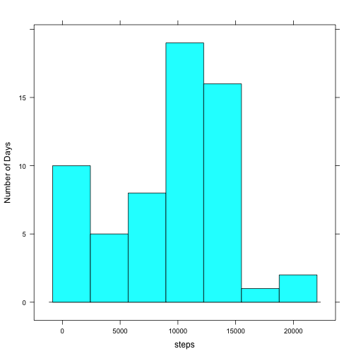
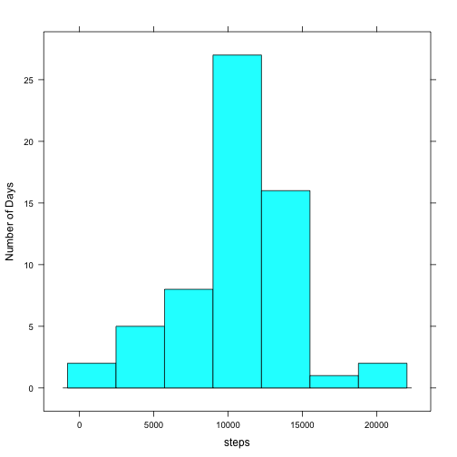
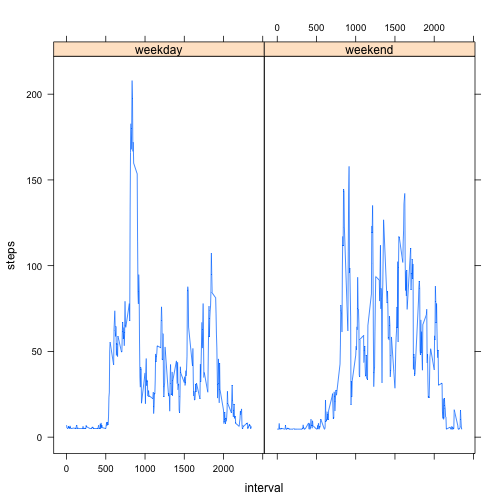

## Initial Steps

Loading required libraries:


```r
library(lattice)
library(dplyr)
```

## Loading and preprocessing the data

Note: it is assumed activity.csv file is unzipped.

Reading data from the file:


```r
activity <- read.csv(file = "activity.csv", header = TRUE)
```

## What is mean total number of steps taken per day?


Total number of steps taken per day:


```r
stepsPerDay <- summarize(group_by(activity, date), steps = sum(steps, na.rm = TRUE))
```


Histogram of the total number of steps taken each day:


```r
with(stepsPerDay, histogram(~steps, type="count", ylab="Number of Days"))
```

 


Mean number of steps taken per day:


```r
mean(stepsPerDay$steps, na.rm = TRUE)
```

```
## [1] 9354.23
```


Median number of steps taken per day:


```r
median(stepsPerDay$steps, na.rm = TRUE)
```

```
## [1] 10395
```

## What is the average daily activity pattern?


Number of steps per interval averaged across all days:


```r
stepsPerInterval <- summarize(group_by(activity, interval), steps = mean(steps, na.rm = TRUE))
```


Plot showing average number of steps per interval:


```r
with(stepsPerInterval, xyplot(steps ~ interval, type="l"))
```

 


On average across all the days, this 5-minute interval contains the maximum number of steps:


```r
with(stepsPerInterval, interval[which.max(steps)])
```

```
## [1] 835
```

## Imputing missing values


Total number of missing values in the dataset:


```r
nrow(activity[is.na(activity$steps), ])
```

```
## [1] 2304
```


To impute missing values, an average number of steps across all non-missing intervals is used:


```r
avgOverall <- mean(activity[!is.na(activity$steps), ]$steps)
avgOverall
```

```
## [1] 37.3826
```


Dataset with imputed values:


```r
# convert column with a number of steps to double in order not to miss fractions
imputedActivity <- transform(activity, steps = as.double(steps))

# for every observation with missing number of steps, use an average one
for (i in 1:nrow(imputedActivity)) {
  if (is.na(imputedActivity[i, ]$steps)) {
    imputedActivity[i, ]$steps <- avgOverall
  }
}
```


Total number of steps taken per day after imputing missing values:


```r
imputedStepsPerDay <- summarize(group_by(imputedActivity, date), steps = sum(steps))
```


Histogram of the total number of steps taken each day:


```r
with(imputedStepsPerDay, histogram(~steps, type="count", ylab="Number of Days"))
```

 


Mean number of steps taken per day:


```r
mean(imputedStepsPerDay$steps)
```

```
## [1] 10766.19
```


Median number of steps taken per day:


```r
median(imputedStepsPerDay$steps)
```

```
## [1] 10766.19
```

After imputing missing values we can see mean and median number of steps increased and the histogram doesn't have oddly high left tail anymore.

## Are there differences in activity patterns between weekdays and weekends?

Split activity dataset into observations occurred during the weekdays or during the weekend:


```r
getDayType <- function(date) {
  # use initValue to setup a type for dayType variable,
  # it's value will be overridden later
  initValue <- factor("weekend", levels = c("weekday", "weekend"))
  dayType <- c(initValue)
  
  day <- weekdays(date)
  slice <- day == "Saturday" | day == "Sunday"
  dayType[slice] <- "weekend"  # everything Saturday or Sunday is weekend...
  dayType[!slice] <- "weekday" # ...everything else is weekday
  dayType
}

splitActivity <- mutate(imputedActivity, weekTime = getDayType(as.Date(date)))
```


Number of steps per interval averaged across all weekdays and weekends:


```r
splitStepsPerInterval <- summarize(group_by(splitActivity, interval, weekTime), steps = mean(steps))
```

Plot average number of steps per interval during the weekend and the rest of the week:


```r
par(mfrow = c(1, 2))
with(splitStepsPerInterval, xyplot(steps ~ interval | weekTime, type="l"))
```

 
